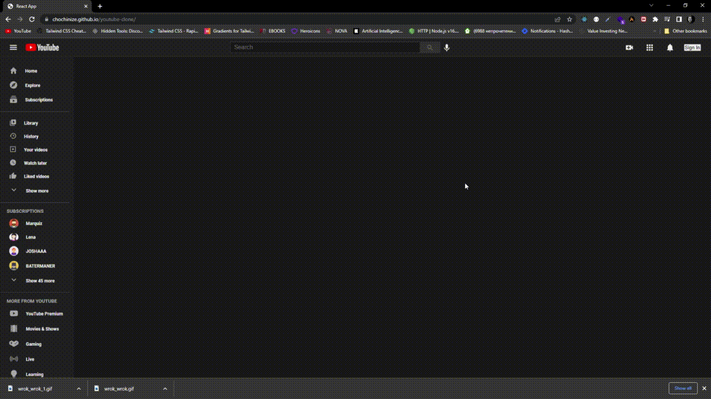

</br>
</br>
</br>
</br>

<div id="top"></div>
<!--
*** Thanks for checking out the Best-README-Template. If you have a suggestion
*** that would make this better, please fork the repo and create a pull request
*** or simply open an issue with the tag "enhancement".
*** Don't forget to give the project a star!
*** Thanks again! Now go create something AMAZING! :D
-->


<!-- PROJECT SHIELDS -->
<!--
*** I'm using markdown "reference style" links for readability.
*** Reference links are enclosed in brackets [ ] instead of parentheses ( ).
*** See the bottom of this document for the declaration of the reference variables
*** for contributors-url, forks-url, etc. This is an optional, concise syntax you may use.
*** https://www.markdownguide.org/basic-syntax/#reference-style-links
-->
<!-- [![Contributors][contributors-shield]][contributors-url]
[![Forks][forks-shield]][forks-url]
[![Stargazers][stars-shield]][stars-url]
[![Issues][issues-shield]][issues-url]
[![MIT License][license-shield]][license-url]
[![LinkedIn][linkedin-shield]][linkedin-url] -->

 


<br />
<div align="center">


 
   <br />
    <a href="https://chochinize.github.io">View Demo</a>
    ·
  
   </p>
</div>


&#8595;

   
### About
</br>
</br>
</br>
 

 


<!-- USAGE EXAMPLES -->

### Built With

```js
const USED =  {
    "@testing-library/jest-dom": "^5.14.1",
    "@testing-library/react": "^11.2.7",
    "@testing-library/user-event": "^12.8.3",
    "axios": "^0.21.1",
    "dotenv": "^10.0.0",
    "moment": "^2.29.1",
    "node-sass": "^6.0.1",
    "react": "^17.0.2",
    "react-dom": "^17.0.2",
    "react-icons": "^4.2.0",
    "react-player": "^2.9.0",
    "react-router-dom": "^5.2.0",
    "react-scripts": "4.0.3",
    "react-show-more-text": "^1.4.6",
    "react-tooltip": "^4.2.21",
    "web-vitals": "^1.1.2"
  },
``` 
<!-- ROADMAP -->


<!-- CONTACT -->


<!-- ACKNOWLEDGMENTS -->
### Acknowledgments

Use this space to list resources you find helpful and would like to give credit to. I've included a few of my favorites to kick things off!

* [google-dev-console](https://console.cloud.google.com/apis/dashboard)


<p align="right">(<a href="#top">back to top</a>)</p>